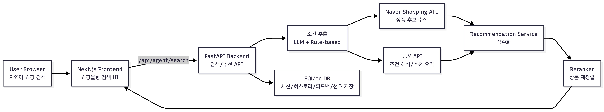

# Shopping AI Agent

자연어 쇼핑 검색, 추천, 조건 누적형 후속 탐색을 지원하는 쇼핑 검색 MVP입니다.  
단순 챗봇 데모가 아니라, 실제 쇼핑몰 검색 화면처럼 상품 탐색이 먼저 보이고 AI는 추천을 보조하는 구조를 목표로 합니다.

## System Architecture



이 프로젝트는 Next.js 기반 프론트엔드, FastAPI 기반 백엔드, Naver Shopping API, LLM API, 추천 서비스, Reranker, SQLite DB로 구성됩니다.

사용자가 자연어로 쇼핑 조건을 입력하면 프론트엔드가 백엔드의 `/api/agent/search`를 호출하고, 백엔드는 LLM과 규칙 기반 로직을 통해 검색 조건을 추출합니다. 이후 Naver Shopping API에서 상품 후보를 수집하고, Recommendation Service와 Reranker가 가격, 리뷰, 배송, 선호도, 대화 문맥을 반영해 상품을 재정렬합니다. 최종 결과는 상품 카드, 추천 요약, 검색 히스토리 형태로 프론트엔드에 표시됩니다.

## 프로젝트 개요

사용자는 다음과 같은 자연어를 검색창에 입력할 수 있습니다.

- `10만원대 가습기 추천해줘`
- `20만원 이하 자취방용 조용한 제습기 추천해줘`
- `지금 결과에서 리뷰 많은 상품만 보여줘`
- `top3 중 하나만 남기고 왜 맞는지 설명해줘`

시스템은 이 요청을 해석해 상품 조건을 추출하고, 네이버 쇼핑 API에서 후보를 수집한 뒤, 추천 서비스와 재정렬 로직을 통해 더 적합한 상품을 상단에 노출합니다.

## 핵심 기능

- 자연어 기반 쇼핑 검색
- 가격, 용도, 중요 기능, 배송, 리뷰 수 조건 추출
- 검색 후 추가 프롬프트를 통한 조건 누적형 탐색
- 사용자 피드백 기반 선호도 반영
- 홈 화면 추천 레일
  - `BEST 상품`
  - `고객님을 위한 상품`
  - `오늘의 추천 상품`
- AI 추천 요약, 선택 상품 인사이트, 간단한 대화형 검색 히스토리
- LLM 실패 시 규칙 기반 fallback 유지

## 기술 스택

### Frontend

- Next.js 15
- React
- TypeScript

### Backend

- FastAPI
- SQLAlchemy
- Pydantic

### External Services

- 네이버 쇼핑 검색 API
- ChatKU Gateway(OpenAI 호환 API)

### Storage

- 기본: SQLite
- 확장 가능: PostgreSQL

### Deployment

- AWS EC2
- Nginx
- systemd

## 현재 구조

```text
shopping-agent-mvp/
├── backend/
│   ├── app/
│   │   ├── main.py
│   │   ├── config.py
│   │   ├── database.py
│   │   ├── models.py
│   │   ├── schemas.py
│   │   └── services/
│   ├── run.py
│   ├── .env.example
│   └── requirements.txt
├── frontend/
│   ├── app/
│   │   ├── page.tsx
│   │   ├── layout.tsx
│   │   ├── components/
│   │   ├── hooks/
│   │   └── lib/
│   ├── .env.example
│   └── package.json
├── deploy/
│   └── ec2/
└── README.md
```

## 동작 흐름

1. 사용자가 프론트엔드 검색창에 자연어를 입력합니다.
2. 프론트엔드는 `/api/agent/search` 또는 `/api/agent/refine`를 호출합니다.
3. 백엔드는 대화 문맥, 필터, 이전 선호도를 합쳐 현재 조건을 해석합니다.
4. 필요 시 LLM으로 조건 추출과 짧은 응답 생성을 수행합니다.
5. 네이버 쇼핑 API에서 상품 후보를 수집합니다.
6. 추천 서비스와 reranker가 가격, 리뷰, 배송, 선호도, 문맥을 반영해 상품을 재정렬합니다.
7. 백엔드는 상품 목록, top 추천, 추천 이유, 대화 trace를 반환합니다.
8. 프론트엔드는 상품 그리드, 홈 레일, 추천 요약, 선택 상품 인사이트를 렌더링합니다.

## 추천 로직 요약

현재 추천 로직은 크게 네 단계로 동작합니다.

### 1. 조건 해석

- 카테고리
- 가격 상한/하한
- 중요 기능
- 용도
- 브랜드 선호/제외
- 리뷰 수, 배송 등 정렬 조건

LLM을 사용하되, 실패하거나 과도한 비용이 필요한 경우 규칙 기반 추출로 fallback합니다.

### 2. 후보 수집

조건에서 검색어를 만들고 네이버 쇼핑 API를 호출합니다.  
여러 검색어 결과를 합쳐 중복을 제거하고 후보군을 구성합니다.

### 3. 재정렬

후보 상품을 다음 요소로 점수화합니다.

- 검색어와 상품명/카테고리 일치도
- 가격 조건 적합성
- 리뷰 수, 평점 관련 힌트
- 배송 정보
- 사용자의 선호도/비선호
- 현재 대화에서 누적된 조건

### 4. 후속 탐색

사용자가 `리뷰 많은 것만`, `가성비 순`, `top3 중 하나만` 같은 후속 요청을 하면 현재 결과와 대화 문맥을 기반으로 다시 좁혀서 보여줍니다.

## 프론트엔드 UI 설명

현재 UI는 쇼핑몰 검색 페이지에 가깝게 구성되어 있습니다.

- 상단 헤더
  - 로고
  - 자연어 검색창
  - 검색 버튼
  - 홈 레일 앵커 메뉴
- 홈 화면
  - 인기 키워드
  - 가로 스크롤 추천 레일
- 검색 화면
  - 왼쪽 필터
  - 중앙 상품 결과
  - 오른쪽 선택 상품 인사이트
- 검색창 상단/주변
  - 간단한 질문/응답 형태의 검색 히스토리
  - 실제 챗봇처럼 과하지 않게 문맥만 보여주는 구조

## 주요 API

### GET `/health`

서버 상태와 외부 연동 준비 여부를 확인합니다.

### POST `/api/agent/search`

자연어 검색의 메인 진입점입니다.

예시:

```json
{
  "user_id": "demo-user",
  "query": "20만원 이하 자취방용 조용한 제습기 추천해줘",
  "page": 1,
  "display": 20
}
```

### POST `/api/agent/refine`

현재 검색 결과를 바탕으로 조건을 더 좁힙니다.

예시:

```json
{
  "user_id": "demo-user",
  "conversation_id": "conversation-id",
  "message": "지금 결과에서 리뷰 많은 상품만 보여줘"
}
```

### POST `/api/agent/feedback`

좋아요/싫어요 등 사용자 피드백을 저장합니다.

### POST `/api/agent/final-select`

최종 선택한 상품을 저장합니다.

### GET `/api/history`

최근 검색 이력을 반환합니다.

### POST `/api/recommend`

사용자 선호도를 반영한 추천 결과를 별도로 요청할 때 사용합니다.

## 환경 변수

### Backend

`backend/.env.example`

```env
CHATKU_API_KEY=your_chatku_api_key
CHATKU_BASE_URL=https://factchat-cloud.mindlogic.ai/v1/gateway
CHATKU_MODEL=gpt-5.4
CHATKU_MODEL_PLANNER=gpt-5.4
CHATKU_MODEL_EXTRACTOR=gpt-5.4-mini
CHATKU_MODEL_FOLLOWUP=gpt-5.4-mini
CHATKU_MODEL_SUMMARY=gpt-5.4-nano

NAVER_CLIENT_ID=your_naver_client_id
NAVER_CLIENT_SECRET=your_naver_client_secret

DATABASE_URL=sqlite:///./shopping_agent.db
FRONTEND_ORIGIN=http://localhost:3000
```

설명:

- `CHATKU_*`: LLM 호출 관련 설정
- `NAVER_*`: 네이버 쇼핑 API 인증 정보
- `DATABASE_URL`: 기본은 SQLite, 필요 시 PostgreSQL로 교체 가능
- `FRONTEND_ORIGIN`: CORS 허용 프론트 주소

### Frontend

`frontend/.env.example`

```env
NEXT_PUBLIC_API_BASE_URL=http://localhost:8000
```

설명:

- 프론트엔드가 호출할 백엔드 API 주소입니다.

## 로컬 실행 방법

### 1. 백엔드 실행

```bash
cd backend
python3 -m venv .venv
source .venv/bin/activate
pip install --upgrade pip
pip install -r requirements.txt
cp .env.example .env.local
python run.py
```

접속:

- API: `http://localhost:8000`
- Swagger: `http://localhost:8000/docs`

### 2. 프론트엔드 실행

```bash
cd frontend
npm install
cp .env.example .env.local
npm run dev
```

접속:

- Frontend: `http://localhost:3000`

## 빌드 확인

프론트엔드 프로덕션 빌드 확인:

```bash
cd frontend
npm run build
```

## 데이터베이스

현재 기본 DB는 `SQLite`입니다.

- 기본 파일: `backend/shopping_agent.db`
- 루트 또는 서버 환경에 따라 `shopping_agent.db`가 별도 위치에 생길 수 있습니다.

프로젝트는 SQLite 기준으로 바로 실행 가능하게 되어 있고, 운영 환경에서는 `PostgreSQL`로 전환할 수 있게 구조를 열어두었습니다.

## fallback 및 안정성

이 프로젝트는 외부 API 실패 시에도 검색 흐름이 완전히 깨지지 않도록 설계되어 있습니다.

- LLM 실패 시 규칙 기반 조건 추출 사용
- 요약 실패 시 템플릿 기반 응답 사용
- 홈 화면 API 실패 시 더미 상품 fallback 사용
- 네이버 API 요청에 timeout / retry 적용
- 기본 rate limit 적용
- request id 및 structured log 기록

## EC2 배포

배포 문서는 별도로 정리되어 있습니다.

- [deploy/ec2/README.md](/Users/hwangseonghun/shopping-agent-mvp/deploy/ec2/README.md)

포함 내용:

- EC2 패키지 설치
- 프로젝트 업로드
- backend / frontend 환경 설정
- systemd 서비스 등록
- Nginx reverse proxy 연결
- HTTPS(certbot) 적용

## 현재 한계

- 네이버 쇼핑 API 응답 품질에 결과가 크게 의존합니다.
- 상세 리뷰 본문 분석, 가격 이력, 재고 정보는 아직 미구현입니다.
- 사용자 장기 선호 메모리는 MVP 수준이며 더 정교한 RAG/벡터 메모리로 확장 여지가 있습니다.
- 운영 환경 기준 모니터링, 알림, 장애 자동 복구는 추가 보완이 필요합니다.

## 파일 설명

### Backend 주요 파일

- [backend/app/main.py](/Users/hwangseonghun/shopping-agent-mvp/backend/app/main.py)
  FastAPI 엔트리포인트입니다. 라우터, CORS, rate limit, health check, API 엔드포인트가 정의되어 있습니다.

- [backend/app/config.py](/Users/hwangseonghun/shopping-agent-mvp/backend/app/config.py)
  환경 변수와 모델별 설정을 관리합니다.

- [backend/app/database.py](/Users/hwangseonghun/shopping-agent-mvp/backend/app/database.py)
  SQLAlchemy 엔진, 세션, DB 연결 설정을 담당합니다.

- [backend/app/models.py](/Users/hwangseonghun/shopping-agent-mvp/backend/app/models.py)
  검색 세션, 피드백, 선호도 메모리 등 DB 모델이 정의되어 있습니다.

- [backend/app/schemas.py](/Users/hwangseonghun/shopping-agent-mvp/backend/app/schemas.py)
  API 요청/응답 스키마를 정의합니다.

### Frontend 주요 파일

- [frontend/app/page.tsx](/Users/hwangseonghun/shopping-agent-mvp/frontend/app/page.tsx)
  홈 화면과 검색 결과 화면의 최상위 UI를 구성합니다.

- [frontend/app/layout.tsx](/Users/hwangseonghun/shopping-agent-mvp/frontend/app/layout.tsx)
  앱 메타데이터와 전역 레이아웃을 설정합니다.

- `frontend/app/components/*`
  검색 헤더, 상품 카드, 상품 그리드, 홈 레일, 인사이트 패널 등 화면 구성 컴포넌트입니다.

- `frontend/app/hooks/useShoppingSearch.ts`
  검색 상태, 홈 레일 로딩, refine 흐름, 피드백 처리 등 프론트 검색 로직을 관리합니다.

- `frontend/app/lib/*`
  API 호출, 상품 매핑, 포맷팅 유틸리티를 포함합니다.

### Deploy 주요 파일

- [deploy/ec2/shopping-agent-backend.service](/Users/hwangseonghun/shopping-agent-mvp/deploy/ec2/shopping-agent-backend.service)
  백엔드 systemd 서비스 파일입니다.

- [deploy/ec2/shopping-agent-frontend.service](/Users/hwangseonghun/shopping-agent-mvp/deploy/ec2/shopping-agent-frontend.service)
  프론트엔드 systemd 서비스 파일입니다.

- [deploy/ec2/nginx.shopping-ai-agent.conf](/Users/hwangseonghun/shopping-agent-mvp/deploy/ec2/nginx.shopping-ai-agent.conf)
  Nginx reverse proxy 설정 예시입니다.

## 다음 개선 방향

- PostgreSQL 전환 및 운영 데이터 분리
- 사용자 장기 선호도 메모리 고도화
- 추천 이유 설명 품질 개선
- 홈 레일 캐싱 및 첫 화면 로딩 최적화
- HTTPS, 도메인, 모니터링, 백업 체계 강화

